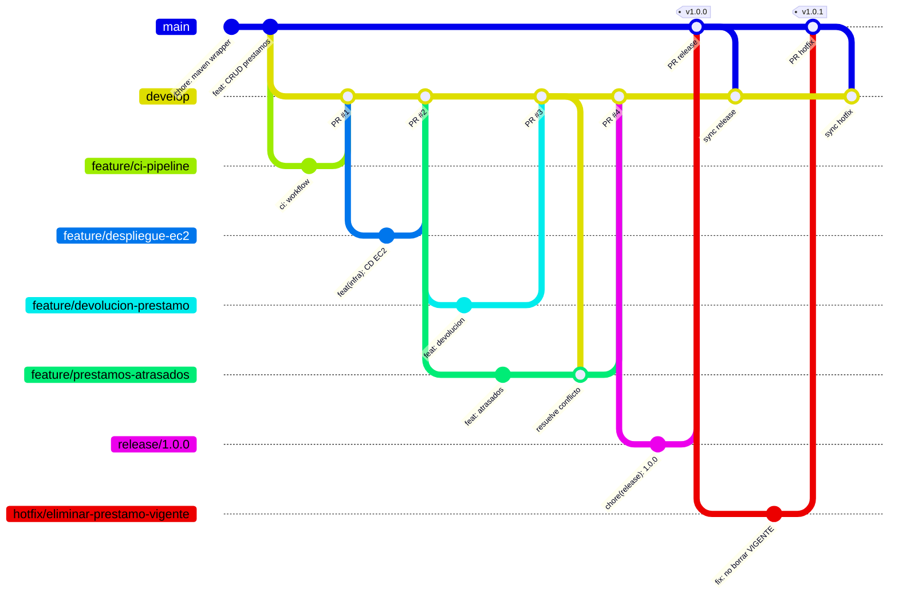

# ms-prestamos

[](https://github.com/juatapiaoing/EV1-despliegue-801D/actions/workflows/ci.yml)
[](https://github.com/juatapiaoing/EV1-despliegue-801D/actions/workflows/cd-deploy.yml)

Microservicio de gestión de préstamos de una biblioteca. Registra el retiro de un
ejemplar por parte de un socio, mantiene el historial de cada usuario, permite
registrar la devolución y detecta los préstamos atrasados.

Este repositorio es la entrega de la **Evaluación Parcial 1 de Ingeniería DevOps
(DOY0101, Duoc UC)**: sobre el microservicio se construyó el flujo de
ramificación GitFlow, una simulación de trabajo colaborativo con pull requests, un
pipeline de integración continua con GitHub Actions y un despliegue continuo en
una instancia EC2 de AWS.

## Índice

1. [Contexto](#1-contexto)
2. [Stack técnico](#2-stack-técnico)
3. [Estructura del repositorio](#3-estructura-del-repositorio)
4. [Modelo de dominio](#4-modelo-de-dominio)
5. [API REST](#5-api-rest)
6. [Ejecución local](#6-ejecución-local)
7. [Perfiles y configuración](#7-perfiles-y-configuración)
8. [Pruebas](#8-pruebas)
9. [Despliegue en AWS](#9-despliegue-en-aws)
10. [Estrategia de ramificación](#10-estrategia-de-ramificación)
11. [Guía de buenas prácticas del repositorio](#11-guía-de-buenas-prácticas-del-repositorio)
12. [Simulación de trabajo colaborativo y trazabilidad](#12-simulación-de-trabajo-colaborativo-y-trazabilidad)
13. [Integración y despliegue continuo](#13-integración-y-despliegue-continuo)
14. [Declaración de uso de Inteligencia Artificial](#14-declaración-de-uso-de-inteligencia-artificial)
15. [Conclusiones y reflexión personal](#15-conclusiones-y-reflexión-personal)

---

## 1. Contexto

El microservicio nace del proyecto *Biblioteca* desarrollado en la asignatura de
Arquitectura de Software, pero fue reescrito como **servicio autónomo**: no se
registra en Eureka, no pasa por un API Gateway y no valida tokens JWT. Esa
decisión es deliberada: un artefacto que se despliega solo, con un único `.jar`
y sin dependencias de otros servicios, es el caso más simple sobre el que montar
un pipeline de CI/CD y el que permite concentrar el esfuerzo en el flujo DevOps y
no en la orquestación.

## 2. Stack técnico

| Componente | Versión | Rol |
|---|---|---|
| Java | 21 (LTS) | Lenguaje y runtime |
| Spring Boot | 3.5.15 | Framework base |
| Spring Web | — | Controladores REST |
| Spring Data JPA + Hibernate | — | Persistencia |
| Spring HATEOAS | — | Enlaces de navegación (`_links`) |
| Spring Boot Actuator | — | `/actuator/health` como healthcheck del despliegue |
| Bean Validation | — | Validación declarativa de los DTO |
| MapStruct | 1.5.5.Final | Mapeo entidad ↔ DTO en tiempo de compilación |
| Lombok | 1.18.44 | Reducción de boilerplate |
| springdoc-openapi | 2.8.17 | Documentación Swagger UI |
| H2 | 2.3.232 | Base de datos en memoria (perfil `dev` y CI) |
| MySQL | 8.x | Base de datos del perfil `prod` (EC2) |
| Maven Wrapper | 3.9.14 | Build reproducible sin instalar Maven |
| GitHub Actions | — | Integración y despliegue continuo |
| AWS EC2 + systemd | Ubuntu 24.04 | Entorno de ejecución en la nube |

## 3. Estructura del repositorio

```
EV1-despliegue-801D/
├── .github/
│   ├── pull_request_template.md   Plantilla que guía la descripción y revisión de cada PR
│   └── workflows/
│       ├── ci.yml                 CI: build + pruebas en push a develop y PR a main/develop
│       └── cd-deploy.yml          CD: despliegue en EC2 en cada push a main
├── .mvn/wrapper/                  Maven Wrapper (build reproducible)
├── db/
│   └── init-prestamos.sql         Creación de BD y usuario de aplicación en MySQL (instalación manual)
├── docs/
│   ├── despliegue-aws.md          Guía de despliegue en EC2 (aprovisionamiento, CD, operación)
│   ├── evidencias/                Salidas reales del despliegue en EC2 y runs de CD
│   └── enunciado/                 Material de la evaluación
├── infra/aws/
│   ├── provision-ec2.sh           Aprovisiona llaves, security group e instancia con la AWS CLI
│   └── user-data.sh               cloud-init: JRE 21, MySQL, credenciales y unidad systemd
├── src/
│   ├── main/
│   │   ├── java/cl/jctapia/prestamos/
│   │   │   ├── config/            Configuración de OpenAPI
│   │   │   ├── controller/        Capa HTTP (REST + HATEOAS + Swagger)
│   │   │   ├── dto/               Contratos de entrada y salida
│   │   │   ├── exception/         Excepciones propias y manejador global
│   │   │   ├── mapper/            MapStruct: entidad ↔ DTO
│   │   │   ├── model/             Entidad JPA y enum de estados
│   │   │   ├── repository/        Spring Data JPA
│   │   │   └── service/           Reglas de negocio
│   │   └── resources/
│   │       ├── application.yml        Configuración común
│   │       ├── application-dev.yml    H2 en memoria
│   │       ├── application-prod.yml   MySQL vía variables de entorno
│   │       └── data.sql               Datos de prueba (solo perfil dev)
│   └── test/java/cl/jctapia/prestamos/
│       ├── MsPrestamosApplicationTests.java   Prueba de arranque del contexto
│       └── service/PrestamoServiceTest.java   Pruebas unitarias con Mockito
├── .gitattributes                 Finales de línea LF para scripts que corren en Linux
├── .gitignore                     Excluye target/, IDE y secretos (.env, *.pem)
├── mvnw / mvnw.cmd
├── pom.xml
└── README.md
```

La estructura sigue una **arquitectura en capas**: `controller → service →
repository`, con los DTO como frontera hacia el exterior. Ninguna capa salta a la
siguiente: el controlador nunca toca el repositorio y la entidad JPA nunca se
serializa directamente hacia el cliente.

## 4. Modelo de dominio

### Entidad `Prestamo`

| Campo | Tipo | Notas |
|---|---|---|
| `id` | `Long` | Autogenerado |
| `codigoLibro` | `String(20)` | Código interno del ejemplar físico, no el ISBN del título |
| `rutUsuario` | `String(12)` | RUT del socio, formato `12345678-9` |
| `fechaPrestamo` | `LocalDate` | Día en que se retira el ejemplar |
| `fechaVencimiento` | `LocalDate` | Fecha límite de devolución |
| `fechaDevolucion` | `LocalDate` | `null` mientras el ejemplar no regrese |
| `estado` | `EstadoPrestamo` | `VIGENTE` · `DEVUELTO` · `CANCELADO` |
| `observacion` | `String(255)` | Texto libre, opcional |

El **atraso no se persiste**: se deriva comparando `fechaVencimiento` con la fecha
actual mientras el préstamo siga `VIGENTE`. Guardarlo como columna obligaría a un
proceso que recorriera la tabla todos los días para mantenerla al corriente.

### Reglas de negocio

1. La fecha de vencimiento debe ser **posterior** a la fecha de préstamo.
2. Un mismo ejemplar **no puede tener dos préstamos `VIGENTE` simultáneos**.
3. Todo préstamo nace en estado `VIGENTE`; el estado y la fecha de devolución no
   se pueden alterar desde el `PUT`, para que nadie cierre un préstamo enviando un
   JSON manipulado.
4. La **devolución** es la única vía para cerrar un préstamo y solo aplica a
   préstamos `VIGENTE`; fija la fecha de devolución en el día actual.
5. Un préstamo está **atrasado** si sigue `VIGENTE` y su vencimiento es anterior a
   hoy. El que vence hoy todavía no lo está.
6. Un préstamo `VIGENTE` **no se puede eliminar**: el ejemplar sigue fuera de la
   biblioteca y borrar el registro haría perder su rastro. Primero se devuelve o
   se cancela (corregido en el hotfix `v1.0.1`).

## 5. API REST

Base: `http://localhost:9005/api/v1/prestamos`

| Método | Ruta | Descripción | Códigos |
|---|---|---|---|
| `GET` | `/` | Lista todos los préstamos | 200 |
| `GET` | `/{id}` | Obtiene un préstamo por ID | 200, 404 |
| `GET` | `/usuario/{rut}` | Historial de un socio, del más reciente al más antiguo | 200 |
| `GET` | `/atrasados` | Préstamos `VIGENTE` con fecha de vencimiento anterior a hoy, del más atrasado al más reciente | 200 |
| `POST` | `/` | Registra un préstamo en estado `VIGENTE` | 201, 400, 409 |
| `PUT` | `/{id}` | Actualiza los datos de un préstamo | 200, 400, 404, 409 |
| `PATCH` | `/{id}/devolucion` | Registra la devolución: estado `DEVUELTO` y fecha de hoy. Solo para préstamos `VIGENTE` | 200, 404, 409 |
| `DELETE` | `/{id}` | Elimina un préstamo. Un préstamo `VIGENTE` no se puede eliminar: primero debe devolverse o cancelarse | 204, 404, 409 |

Todas las respuestas de error comparten el mismo envelope `ApiError`
(`timestamp`, `status`, `error`, `message`, `errors`, `path`), de modo que el
cliente puede parsear cualquier fallo con un único modelo.

**Ejemplo de creación**

```bash
curl -X POST http://localhost:9005/api/v1/prestamos \
  -H "Content-Type: application/json" \
  -d '{
        "codigoLibro": "BIB-5501",
        "rutUsuario": "18345678-9",
        "fechaPrestamo": "2026-09-08",
        "fechaVencimiento": "2026-09-22",
        "observacion": "Retiro en mesón central"
      }'
```

**Ejemplo de devolución y consulta de atrasados**

```bash
curl -X PATCH http://localhost:9005/api/v1/prestamos/2/devolucion
curl http://localhost:9005/api/v1/prestamos/atrasados
```

## 6. Ejecución local

### Requisitos

- JDK 21
- No se necesita Maven instalado (se usa el Maven Wrapper)
- No se necesita MySQL para desarrollar: el perfil `dev` usa H2 en memoria

### Levantar el servicio

```bash
# Linux / macOS
./mvnw spring-boot:run

# Windows
.\mvnw.cmd spring-boot:run
```

| Recurso | URL |
|---|---|
| Swagger UI | http://localhost:9005/swagger-ui.html |
| OpenAPI JSON | http://localhost:9005/v3/api-docs |
| Consola H2 (solo `dev`) | http://localhost:9005/h2-console |
| Healthcheck | http://localhost:9005/actuator/health |

La consola H2 se conecta con JDBC URL `jdbc:h2:mem:prestamosdb`, usuario `sa` y
contraseña vacía. El perfil `dev` carga cinco préstamos de ejemplo desde
`data.sql` en cada arranque.

### Compilar el artefacto

```bash
./mvnw clean package
# genera target/ms-prestamos-<version>.jar
```

## 7. Perfiles y configuración

| Perfil | Base de datos | `ddl-auto` | Datos de prueba | Uso |
|---|---|---|---|---|
| `dev` (por defecto) | H2 en memoria | `create-drop` | Sí (`data.sql`) | Desarrollo local y pipeline de CI |
| `prod` | MySQL 8.x | `update` | No | Instancia EC2 |

El perfil `prod` **no contiene ninguna credencial**. Se inyectan como variables de
entorno desde la unidad de systemd, de manera que las contraseñas del servidor
nunca queden versionadas en el repositorio:

| Variable | Por defecto | Descripción |
|---|---|---|
| `SPRING_PROFILES_ACTIVE` | `dev` | Perfil activo |
| `SERVER_PORT` | `9005` | Puerto HTTP |
| `DB_HOST` | `localhost` | Host de MySQL |
| `DB_PORT` | `3306` | Puerto de MySQL |
| `DB_NAME` | `prestamos` | Nombre de la base de datos |
| `DB_USER` | — (obligatoria) | Usuario de aplicación |
| `DB_PASSWORD` | — (obligatoria) | Contraseña del usuario |

## 8. Pruebas

```bash
./mvnw test
```

- `PrestamoServiceTest` — 14 pruebas unitarias con Mockito sobre las reglas de
  negocio (creación, actualización, devolución, atrasados, consultas y borrado).
  El repositorio y el mapper se sustituyen por mocks: lo que se verifica es la
  decisión del servicio, no que Hibernate sepa escribir en una tabla.
- `MsPrestamosApplicationTests` — prueba de humo que levanta el contexto completo
  con H2 y detecta beans faltantes, consultas derivadas mal escritas o
  propiedades inválidas en el `application.yml`.

Ambas suites corren **sin base de datos externa**, requisito para que el pipeline
de integración continua sea rápido y no dependa de infraestructura.

## 9. Despliegue en AWS

El microservicio corre en una instancia **EC2 `t3.micro` con Ubuntu 24.04**,
administrado por `systemd` y con MySQL local. La instancia se aprovisiona una
sola vez con la AWS CLI (`infra/aws/provision-ec2.sh`), y a partir de ahí **cada
push a `main` la actualiza automáticamente** mediante el workflow de despliegue
continuo (sección 13).

```
git push main ──► GitHub Actions ──► mvnw package ──► scp .jar ──► systemctl restart ──► curl /actuator/health
```

El procedimiento completo (aprovisionamiento, secretos, operación, plan B manual
y resolución de problemas) está en [docs/despliegue-aws.md](docs/despliegue-aws.md).

Las **evidencias del despliegue real** (salida del aprovisionamiento, runs de CD,
healthcheck, `/actuator/info` y la verificación del hotfix contra la API
desplegada) están en [docs/evidencias/despliegue-ec2.md](docs/evidencias/despliegue-ec2.md).

> La instancia corre en **AWS Academy Learner Lab**, que la detiene al cerrar la
> sesión del laboratorio y le asigna otra IP al arrancarla. Última IP conocida:
> `18.234.175.172` (puerto 9005). Para una revisión en vivo, seguir los pasos de
> la sección 5 de las evidencias; si la instancia no responde en un push a
> `main`, el workflow de CD omite el despliegue con un aviso en vez de fallar.

---

## 10. Estrategia de ramificación

### 10.1 Modelos considerados

Antes de elegir se compararon los tres modelos de ramificación más usados en
equipos que desarrollan y despliegan en la nube:

| Modelo | Cómo funciona | Dónde encaja mejor | Limitaciones |
|---|---|---|---|
| **GitFlow** | Dos ramas permanentes: `main` (lo que está en producción) y `develop` (integración). Las features salen de `develop`; los releases se preparan en `release/*`; las correcciones urgentes en `hotfix/*` salen de `main` y vuelven a ambas ramas. | Productos con **versiones publicadas** y ciclos de entrega definidos; equipos que necesitan separar "lo que se está integrando" de "lo que está desplegado"; proyectos donde varias personas trabajan features en paralelo. | Más ramas y más merges; si el equipo despliega muchas veces al día, `develop` y los releases agregan latencia. |
| **GitHub Flow** | Una sola rama permanente (`main`), siempre desplegable. Cada cambio nace en una rama corta y entra por pull request con CI en verde; el despliegue ocurre al fusionar. | Servicios web con **despliegue continuo** a un único entorno, equipos pequeños, cadencia de entrega alta. | No distingue versiones ni entornos: un hotfix y una feature siguen el mismo camino; sin `develop` no hay un lugar para integrar varias features antes de publicarlas. |
| **Trunk-based development** | Todo el equipo integra en `trunk` (`main`) varias veces al día, con ramas de horas de duración o commits directos. Lo incompleto se oculta con *feature flags*; los releases se cortan desde `trunk` con tags o ramas de release efímeras. | Equipos maduros con **CI muy robusta**, pruebas automatizadas amplias y cultura de commits pequeños; es el modelo que recomiendan los estudios de DevOps (DORA) para alta frecuencia de despliegue. | Exige disciplina y tooling (flags, pruebas rápidas, revisión casi inmediata). Con un equipo nuevo o con pruebas escasas, `main` se rompe con facilidad. |

En un contexto colaborativo en la nube los tres modelos comparten dos pilares:
**pull requests** como punto de revisión y **CI automática** como guardia de la
rama que se despliega. La diferencia está en cuántas ramas permanentes se
mantienen y en qué momento un cambio se considera "listo para producción".

### 10.2 Elección: GitFlow

Para esta entrega se adoptó **GitFlow**, por estas razones:

1. **El encargo exige las ramas `main`, `develop`, `feature/*` y `hotfix/*`** y
   distingue explícitamente cambios tipo feature de cambios tipo hotfix. GitFlow
   es el modelo que define esos roles de forma nativa; GitHub Flow o trunk-based
   obligarían a simularlos.
2. **Hay dos entornos con significado distinto.** `develop` se valida con CI en
   H2, mientras que `main` se despliega en la instancia EC2 con MySQL. Tener una
   rama de integración permite acumular varias features (devolución y atrasados
   entraron por separado) y publicarlas juntas como una versión numerada.
3. **El hotfix tiene un camino propio.** Una corrección urgente sobre lo
   desplegado sale de `main`, se publica de inmediato y vuelve a `develop` sin
   arrastrar features a medio integrar. Esa separación es justamente lo que se
   pide simular.
4. **Sirve igual para una persona que para un equipo.** Aunque este encargo lo
   hice solo, trabajé cada cambio en su rama `feature/*` como si otra persona
   estuviera avanzando en paralelo. Eso permitió reproducir lo que pasa en un
   equipo real: dos features abiertas al mismo tiempo, un conflicto al integrar
   la segunda y su resolución en un punto controlado (ver PR #4 en la sección
   12).

El costo de GitFlow (más merges) es asumible en un proyecto con releases
esporádicos. Si el servicio pasara a desplegarse varias veces al día, el camino
natural sería migrar a trunk-based conservando los pull requests y el pipeline.

### 10.3 Ramas y ciclo de vida

| Rama | Origen | Destino | Vida | Qué contiene |
|---|---|---|---|---|
| `main` | — | — | Permanente | Solo versiones publicadas. Cada merge lleva un tag `vX.Y.Z` y dispara el despliegue en EC2. **No se hace push directo.** |
| `develop` | `main` | `main` (vía release) | Permanente | Rama de integración. Recibe features por PR; cada push ejecuta la CI. |
| `feature/<nombre>` | `develop` | `develop` | Días | Una funcionalidad o mejora. Se borra al fusionar. |
| `release/<version>` | `develop` | `main` y `develop` | Horas/días | Congela el alcance de una versión: solo bump de versión, docs y correcciones menores. |
| `hotfix/<nombre>` | `main` | `main` y `develop` | Horas | Corrección urgente de algo que ya está en producción. |



---

## 11. Guía de buenas prácticas del repositorio

Esta sección es la guía de uso del repositorio. Aplica a
cualquiera que clone el proyecto.

### 11.1 Naming de ramas

Formato: `<tipo>/<descripcion-en-kebab-case>`, en minúsculas, sin acentos ni
espacios, con un nombre que describa **qué** cambia (no quién ni cuándo).

| Tipo | Uso | Ejemplos de este repositorio |
|---|---|---|
| `feature/` | Nueva funcionalidad o mejora | `feature/devolucion-prestamo`, `feature/prestamos-atrasados`, `feature/ci-pipeline` |
| `hotfix/` | Corrección urgente sobre `main` (código o documentación publicada) | `hotfix/eliminar-prestamo-vigente`, `hotfix/ramas-visibles-en-remoto` |
| `release/` | Preparación de una versión | `release/1.0.0` |
| `docs/` | Cambios solo de documentación (opcional; también puede ir como `feature/`) | `docs/guia-repositorio` |

Reglas:

- Una rama, un propósito. Si una feature crece, se divide en dos ramas.
- Al fusionar el PR la rama queda cerrada: no recibe más commits. En un proyecto en
  producción se borra del remoto con *Delete branch*; **en esta entrega las ramas se
  conservan publicadas** para que el docente pueda revisarlas con `git branch -r`.
- Nunca se hace commit directo en `main` ni en `develop`.

### 11.2 Mensajes de commit

Se usa **[Conventional Commits](https://www.conventionalcommits.org/es/)**:

```
<tipo>(<ámbito opcional>): <resumen en imperativo, minúsculas, sin punto final>

<cuerpo opcional: qué cambia y POR QUÉ, no cómo>

<pie opcional: referencias, coautores>
```

| Tipo | Cuándo | Ejemplo real |
|---|---|---|
| `feat` | Nueva funcionalidad visible para el usuario de la API | `feat(prestamos): registrar devolucion de un prestamo` |
| `fix` | Corrección de un defecto | `fix(prestamos): impedir eliminar un prestamo vigente` |
| `docs` | Solo documentación | `docs: README inicial, guia de despliegue en EC2 y script de base de datos` |
| `ci` | Workflows de GitHub Actions | `ci: workflow de GitHub Actions para build y pruebas` |
| `chore` | Mantenimiento sin efecto funcional (wrapper, .gitignore, versión) | `chore: agregar Maven Wrapper y .gitignore` |
| `test` | Solo pruebas | `test(prestamos): cubrir devolucion con prestamo cancelado` |
| `refactor` | Cambio interno sin alterar comportamiento | `refactor(service): extraer validacion de fechas` |

Reglas:

- Resumen de **máximo 72 caracteres**, en imperativo ("agregar", no "agregado").
- El cuerpo explica la motivación y las decisiones; se escribe siempre que el
  cambio no sea trivial.
- Un commit = un cambio coherente que compila y pasa las pruebas. No se mezclan
  refactors con features.
- Los commits hechos a cuatro manos o con apoyo de herramientas llevan el trailer
  `Co-Authored-By:` en el pie.
- El ámbito (`prestamos`, `infra`, `service`, `release`) es opcional pero
  recomendado cuando aclara qué parte del sistema cambia.

### 11.3 Flujo de merge

| Situación | Cómo se integra | Motivo |
|---|---|---|
| `feature/*` → `develop` | Pull request + **merge commit** (`Create a merge commit`) | El merge commit conserva la rama en el historial y muestra qué commits pertenecen a la feature. |
| `release/*` → `main` | Pull request + merge commit + **tag `vX.Y.Z`** | El tag marca exactamente qué commit está desplegado. |
| `hotfix/*` → `main` | Pull request + merge commit + tag de parche (`vX.Y.Z+1`) | Igual que el release, pero con alcance mínimo. |
| `main` → `develop` (tras release u hotfix) | Pull request de sincronización o merge directo por quien cerró el release | `develop` nunca debe quedar atrás de `main`. |
| Rama desactualizada respecto a `develop` | `git fetch` + `git merge origin/develop` en la rama de la feature | Los conflictos se resuelven en la rama, nunca en `develop`. |

No se usa *squash* ni *rebase* al fusionar: se prefiere preservar la historia
real, incluido el commit que resolvió un conflicto, porque esa historia es la
trazabilidad que la evaluación pide documentar.

**Resolución de conflictos** (procedimiento aplicado en el PR #4):

1. `git fetch origin develop` y `git merge origin/develop` en la rama de la feature.
2. Abrir los archivos marcados `UU`, decidir qué se conserva (normalmente ambas
   partes), y quitar los marcadores `<<<<<<<`, `=======`, `>>>>>>>`.
3. Compilar y ejecutar **toda** la suite antes de continuar.
4. Commit del merge explicando en el cuerpo qué se resolvió y por qué.
5. Push; la CI vuelve a correr sobre el resultado del merge.

### 11.4 Estrategia de revisión

- **Todo cambio entra por pull request**, incluso los de una sola línea.
- El PR usa la plantilla de `.github/pull_request_template.md`: qué incluye, por
  qué, cómo probarlo y una lista de verificación.
- En un equipo, el autor no fusiona su propio PR sin que otra persona lo
  revise. En esta entrega, hecha por una sola persona y con un solo usuario de
  GitHub, la revisión se documenta en la descripción del PR (qué incluye, por
  qué, cómo probarlo) y el merge se hace desde la CLI (`gh pr merge --merge`)
  solo cuando la CI está en verde.
- **La CI en verde es condición necesaria** para fusionar. Un check rojo bloquea
  el merge hasta que se corrija en la misma rama.
- El revisor mira: que el cambio haga solo lo que dice el título, que tenga
  pruebas, que no exponga secretos y que el README quede coherente si cambia la
  API.
- Se prefieren PR pequeños (una feature) a PR grandes: se revisan mejor y
  generan menos conflictos.

### 11.5 Control de versiones

- **SemVer** (`MAJOR.MINOR.PATCH`): `MAJOR` rompe compatibilidad de la API,
  `MINOR` agrega funcionalidad compatible, `PATCH` corrige sin cambiar la API.
- `develop` lleva siempre una versión `-SNAPSHOT` en el `pom.xml`. La rama
  `release/*` fija la versión definitiva; el hotfix sube el `PATCH`.
- Cada merge a `main` recibe un **tag anotado** `vX.Y.Z` y una *release* en
  GitHub con el resumen de cambios.
- El artefacto desplegado se llama siempre `ms-prestamos.jar` en la instancia; la
  versión real se consulta en `/actuator/info` o en el tag del commit
  desplegado.

### 11.6 Estructura de carpetas

- Código de producción en `src/main`, pruebas en `src/test`, espejo de paquetes.
- Un paquete por responsabilidad (`controller`, `service`, `repository`, `dto`,
  `model`, `mapper`, `exception`, `config`). Una clase nueva va al paquete que
  corresponde a su rol, no al del archivo que la usa.
- Automatización en `.github/workflows`, infraestructura en `infra/<proveedor>`,
  documentación larga en `docs/`, scripts de base de datos en `db/`.
- **Nunca se versionan**: `target/`, archivos del IDE, `.env`, llaves `.pem`,
  `application-local.yml` (ver `.gitignore`). Las credenciales viajan por
  variables de entorno o por secretos de GitHub Actions.

### 11.7 Comandos Git del flujo diario

| Paso | Comando | Notas |
|---|---|---|
| Clonar | `git clone https://github.com/juatapiaoing/EV1-despliegue-801D.git` | Una sola vez |
| Actualizar `develop` | `git checkout develop && git pull origin develop` | Antes de crear cualquier rama |
| Crear feature | `git checkout -b feature/<nombre> develop` | Siempre desde `develop` |
| Guardar trabajo | `git add <archivos>` · `git commit -m "feat(...): ..."` | Commits pequeños y frecuentes |
| Publicar rama | `git push -u origin feature/<nombre>` | `-u` deja la rama enlazada para los siguientes push |
| Abrir PR | `gh pr create --base develop --head feature/<nombre>` o desde la web | Usar la plantilla |
| Traer cambios de `develop` | `git fetch origin develop && git merge origin/develop` | Resolver conflictos en la rama |
| Fusionar PR | `gh pr merge <n> --merge --delete-branch` | Solo con CI en verde |
| Limpiar | `git checkout develop && git pull && git branch -d feature/<nombre>` | La remota ya la borró GitHub |
| Release | `git checkout -b release/1.0.0 develop` → bump `pom.xml` → PR a `main` → `git tag -a v1.0.0 -m "..."` → `git push origin v1.0.0` | Después, PR `main` → `develop` |
| Hotfix | `git checkout -b hotfix/<nombre> main` → fix → PR a `main` → tag `v1.0.1` | Después, PR `main` → `develop` |

---

## 12. Simulación de trabajo colaborativo y trazabilidad

La simulación reproduce el trabajo de un equipo que integra cambios en
paralelo, aunque en la práctica todas las ramas las trabajé yo. Todo cambio
entró por pull request, y cada PR ejecutó la CI antes del merge. Los enlaces llevan al PR con su descripción, sus commits y el resultado
del workflow.

| PR | Rama | Tipo | Destino | Qué integró | CI |
|---|---|---|---|---|---|
| [#1](https://github.com/juatapiaoing/EV1-despliegue-801D/pull/1) | `feature/ci-pipeline` | feature (CI) | `develop` | Workflow de GitHub Actions y `.gitattributes` | ✅ |
| [#2](https://github.com/juatapiaoing/EV1-despliegue-801D/pull/2) | `feature/despliegue-ec2` | feature (CD) | `develop` | Aprovisionamiento EC2 con AWS CLI, cloud-init y workflow de despliegue | ✅ |
| [#3](https://github.com/juatapiaoing/EV1-despliegue-801D/pull/3) | `feature/devolucion-prestamo` | feature | `develop` | `PATCH /{id}/devolucion` + 3 pruebas | ✅ |
| [#4](https://github.com/juatapiaoing/EV1-despliegue-801D/pull/4) | `feature/prestamos-atrasados` | feature | `develop` | `GET /atrasados` + 2 pruebas. **Conflicto con #3** en `PrestamoServiceTest` resuelto en la rama | ✅ |
| [#5](https://github.com/juatapiaoing/EV1-despliegue-801D/pull/5) | `feature/guia-repositorio` | docs | `develop` | Este README y la plantilla de PR | ✅ |
| [#6](https://github.com/juatapiaoing/EV1-despliegue-801D/pull/6) | `release/1.0.0` | release | `main` | Versión 1.0.0 → tag `v1.0.0` → despliegue automático en EC2 | ✅ |
| [#7](https://github.com/juatapiaoing/EV1-despliegue-801D/pull/7) | `hotfix/eliminar-prestamo-vigente` | hotfix | `main` | `DELETE` rechaza préstamos `VIGENTE` → tag `v1.0.1` → redespliegue | ✅ |
| [#8](https://github.com/juatapiaoing/EV1-despliegue-801D/pull/8) | `main` | sync | `develop` | Devuelve el hotfix a la rama de integración | ✅ |
| [#9](https://github.com/juatapiaoing/EV1-despliegue-801D/pull/9) | `hotfix/ramas-visibles-en-remoto` | hotfix (docs) | `main` | Aclara en la guía que las ramas de la simulación se conservan en el remoto → tag `v1.0.2` | ✅ |
| [#10](https://github.com/juatapiaoing/EV1-despliegue-801D/pull/10) | `main` | sync | `develop` | Devuelve el ajuste de documentación a `develop` | ✅ |
| [#11](https://github.com/juatapiaoing/EV1-despliegue-801D/pull/11) | `develop` | sync | `main` | PR abierto desde la web de GitHub; sin cambios de contenido porque `develop` ya estaba al día con `main` | ✅ |
| [#12](https://github.com/juatapiaoing/EV1-despliegue-801D/pull/12) | `hotfix/readme-autor-unico` | hotfix (docs) | `main` | El encargo se hizo de forma individual: se quita al segundo integrante y se agrega la reflexión personal | ✅ |
| [#13](https://github.com/juatapiaoing/EV1-despliegue-801D/pull/13) | `main` | sync | `develop` | Cerrado sin fusionar: lo reemplazó #15 | — |
| [#14](https://github.com/juatapiaoing/EV1-despliegue-801D/pull/14) | `hotfix/trazabilidad-pr` | hotfix (docs) | `main` | Corrige la numeración de los PR en esta tabla → tag `v1.0.3` | ✅ |
| [#15](https://github.com/juatapiaoing/EV1-despliegue-801D/pull/15) | `main` | sync | `develop` | Devuelve los dos ajustes de documentación a `develop` | ✅ |
| [#16](https://github.com/juatapiaoing/EV1-despliegue-801D/pull/16) | `hotfix/entrega-final` | hotfix | `main` | Evidencias del despliegue, CD que omite el despliegue si la instancia está detenida, ajustes finales del README → tag `v1.0.4` | ✅ |
| [#17](https://github.com/juatapiaoing/EV1-despliegue-801D/pull/17) | `main` | sync | `develop` | Devuelve el cierre de la entrega a `develop` | ✅ |

> Nota sobre #11 y #12: el PR #11 se abrió desde la web mientras un script de la
> CLI fusionaba el hotfix asumiendo que le tocaría ese número. El resultado es que
> los merge commits de #11 y #12 en `main` quedaron con el asunto intercambiado.
> `main` está protegida contra force-push, así que no se reescribe la historia: se
> deja constancia aquí. Lección: tomar el número del PR de la respuesta de
> `gh pr create`, nunca darlo por supuesto.

### Cómo se produjo el conflicto del PR #4 y cómo se resolvió

`feature/prestamos-atrasados` se abrió desde `develop` **antes** de que se
fusionara `feature/devolucion-prestamo` (#3). Ambas ramas agregaron pruebas en el
mismo punto de `PrestamoServiceTest.java` (justo antes de la sección `delete`),
así que al fusionar #3 GitHub marcó el PR #4 como `CONFLICTING`.

```bash
git fetch origin develop
git merge origin/develop          # CONFLICT (content): PrestamoServiceTest.java
# se conservaron ambas secciones de pruebas y se quitaron los marcadores
./mvnw clean verify               # 14 pruebas en verde
git add src/test/.../PrestamoServiceTest.java
git commit                        # "Merge branch 'develop' into feature/prestamos-atrasados"
git push origin feature/prestamos-atrasados
```

El commit de merge quedó en el historial de la rama y la CI volvió a ejecutarse
sobre el resultado antes de fusionar el PR.

### Historial resultante

```bash
git log --oneline --graph --all
```

Se puede reproducir en local, o ver en
[Insights → Network](https://github.com/juatapiaoing/EV1-despliegue-801D/network)
el grafo con `main`, `develop`, las features, el release y el hotfix.

---

## 13. Integración y despliegue continuo

### 13.1 Rol de GitHub Actions en el proceso CI/CD

GitHub Actions es el motor que convierte el repositorio en un pipeline: cada
evento de Git (push, pull request, tag) puede disparar un *workflow* que ejecuta
pasos en una máquina virtual efímera. En este proyecto cumple dos roles:

- **Integración continua (CI):** compilar y probar cada cambio *antes* de que
  llegue a la rama de integración o a producción. Es la red de seguridad de
  `develop` y de `main`: un PR con pruebas rotas no se fusiona.
- **Despliegue continuo (CD):** llevar automáticamente a la instancia EC2 la
  versión que acaba de entrar en `main`. El despliegue deja de ser un
  procedimiento manual y pasa a ser un paso reproducible y auditable en la
  pestaña *Actions*.

### 13.2 Workflow de CI (`.github/workflows/ci.yml`)

| Disparador | Rama | Propósito |
|---|---|---|
| `push` | `develop` | Validar la rama de integración tras cada merge |
| `pull_request` | `main` | Bloquear releases y hotfixes rotos antes de desplegar |
| `pull_request` | `develop` | Validar cada feature en su PR, antes de integrarla |
| `workflow_dispatch` | cualquiera | Ejecución manual desde la pestaña *Actions* |

Pasos: checkout → JDK 21 Temurin con caché de Maven → `./mvnw -B clean verify`
(compila, corre las 15 pruebas con H2 y empaqueta) → publica el `.jar` y los
reportes de Surefire como artefactos del run. Dura menos de un minuto.

### 13.3 Workflow de CD (`.github/workflows/cd-deploy.yml`)

| Disparador | Rama | Propósito |
|---|---|---|
| `push` | `main` | Desplegar cada release y cada hotfix |
| `workflow_dispatch` | `main` | Redesplegar a mano (por ejemplo, tras reaprovisionar la instancia) |

Pasos: comprobar que la instancia responde en el puerto 22 (si no, el despliegue
se omite con un aviso y el run queda en verde) → compilar y probar de nuevo →
preparar la llave SSH desde el secreto
`EC2_SSH_KEY` → `scp` del `.jar` a `/opt/ms-prestamos/ms-prestamos.jar.new` →
`mv` atómico y `systemctl restart` → esperar hasta 120 s a que
`/actuator/health` responda `UP`. Si el healthcheck falla, el job termina en
rojo y vuelca los últimos logs del servicio.

Secretos usados: `EC2_HOST`, `EC2_USER`, `EC2_SSH_KEY`. Se cargan con
`gh secret set` y nunca aparecen en el código ni en los logs.

### 13.4 Entorno cloud

- **Instancia:** EC2 `t3.micro`, Ubuntu 24.04, región `us-east-1`, aprovisionada
  con `infra/aws/provision-ec2.sh` (AWS CLI) y configurada por `user-data.sh`.
- **Runtime:** `systemd` mantiene el proceso vivo, lo reinicia ante fallos y le
  inyecta las variables de entorno desde `/etc/ms-prestamos.env`.
- **Base de datos:** MySQL 8 en la misma instancia, puerto 3306 cerrado al
  exterior.
- **Verificación:** `http://<IP_PUBLICA>:9005/actuator/health` y
  `http://<IP_PUBLICA>:9005/swagger-ui.html`.

### 13.5 Cómo ver los resultados

- Pestaña **Actions** del repositorio: un run por cada push/PR, con logs paso a
  paso y artefactos descargables.
- Badges al inicio de este README: estado del último run de CI en `develop` y de
  CD en `main`.
- En cada PR, la sección *Checks* muestra el job `Compilar y probar (Java 21)`.

---

## 14. Declaración de uso de Inteligencia Artificial

Conforme a las indicaciones del encargo, declaro el uso de IA en este trabajo:

| Herramienta | Para qué se usó | Qué revisé y validé yo |
|---|---|---|
| **Claude Code** (Anthropic, modelo Claude) | Apoyo en la generación del código base del microservicio y sus pruebas, redacción inicial de este README y de `docs/despliegue-aws.md`, escritura de los workflows de GitHub Actions y de los scripts de aprovisionamiento, y ejecución guiada de los comandos Git, `gh` y AWS CLI de la simulación. | Leí y probé cada archivo generado: la suite de pruebas se ejecutó en local y en CI, el despliegue se verificó contra la instancia real, y el contenido del README lo contrasté con el enunciado y la rúbrica. |

La comparación de modelos de ramificación y la justificación de la elección
(sección 10) las revisé y las asumo como propias. La reflexión de la sección 15
es mi experiencia personal con el encargo.

Referencia institucional: https://bibliotecas.duoc.cl/ia

---

## 15. Conclusiones y reflexión personal

### Juan Carlos Tapia

Este encargo lo hice solo, así que me tocó cubrir todos los roles: escribir el
código, abrir los PR, "revisarlos" y fusionarlos. Al principio pensé que
trabajar con ramas y pull requests estando solo iba a ser puro trámite, pero
terminó siendo lo más útil de la evaluación. Me obligó a pensar cada cambio como
algo cerrado, con su nombre, su descripción y sus pruebas, en vez de ir
haciendo commits sueltos en `main` como venía acostumbrado.

Lo que más me costó fue entender bien la diferencia entre `develop` y `main` y
para qué sirve realmente una rama de release o un hotfix. Cuando lo ves en un
diagrama parece obvio, pero recién lo entendí cuando tuve que sacar el hotfix
desde `main` y después acordarme de devolverlo a `develop`. También me sirvió
mucho el conflicto que se armó entre las dos features: la primera vez que vi
los marcadores `<<<<<<<` en el archivo de pruebas no sabía muy bien por dónde
partir, y ahora entiendo que la idea es resolverlo en la rama, correr las
pruebas y recién ahí volver a subir.

De la parte de CI/CD me quedo con algo simple: que el workflow corra solo en
cada push te quita el miedo de romper algo sin darte cuenta. Y ver que un merge
a `main` termina con el servicio actualizado en la instancia de AWS, sin entrar
por SSH a copiar el jar a mano, fue lo que me hizo sentir que esto ya es un
pipeline y no solo un repositorio ordenado. Lo de AWS con la CLI fue lo más
nuevo para mí; tuve varios problemas tontos con rutas y con la llave SSH que me
hicieron perder tiempo, pero también me quedó claro por qué conviene dejar esos
pasos en un script y no hacerlos por la consola.

Usé IA como apoyo, sobre todo para el código base, la documentación y para no
trabarme con los comandos, y creo que lo importante es que ahora entiendo lo
que hay en el repositorio y podría explicarlo o repetirlo sin ayuda. Si tuviera
que hacerlo de nuevo, probablemente partiría el trabajo en ramas más chicas
desde el principio y dejaría la documentación al día en cada PR, en vez de
escribir el README grande al final.

---

**Asignatura:** Ingeniería DevOps (DOY0101) · Duoc UC
**Repositorio:** https://github.com/juatapiaoing/EV1-despliegue-801D
**Autor:** Juan Carlos Tapia
